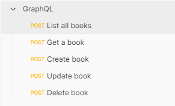
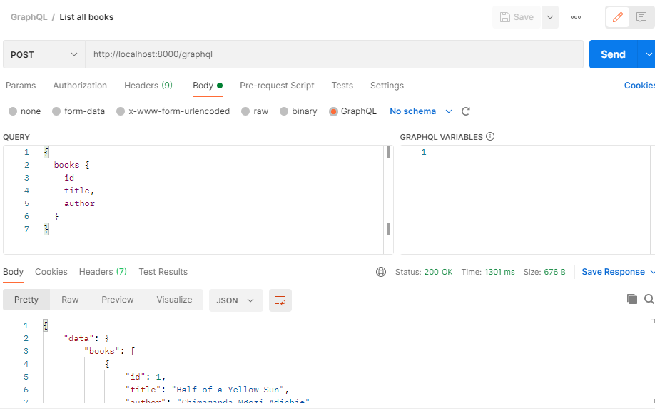

## About Laravel

Simple demo of Laravel project with GraphQL API

This project uses  [Laravel GraphQL](https://github.com/rebing/graphql-laravel) library, and made by following [this](https://www.twilio.com/blog/build-graphql-powered-api-laravel-php) tutorial.

## Setup

1- Run the following command to clone this repo

``` git clone git@github.com:i350/Laravel-GraphQL-Demo.git ```

2- Edit the '.env' file to fit with your database

3- Run the following command to migrate and seed the database
``` php artisan migrate --seed ```

4- Run the local server
``` php artisan serv ```

## Run

You can run and test the project using the following postman collection:

[Click and download](https://raw.githubusercontent.com/i350/Laravel-GraphQL-Demo/master/https://github.com/i350/Laravel-GraphQL-Demo/GraphQL.postman_collection.json)

or 

[Click here](https://www.getpostman.com/collections/841ab566f9c4f7e2a23e)

Download it and import to Postman,

<p align="center">
  
</p>

<p align="center">
  
</p>

Then you will fine a ready-made requests for test
